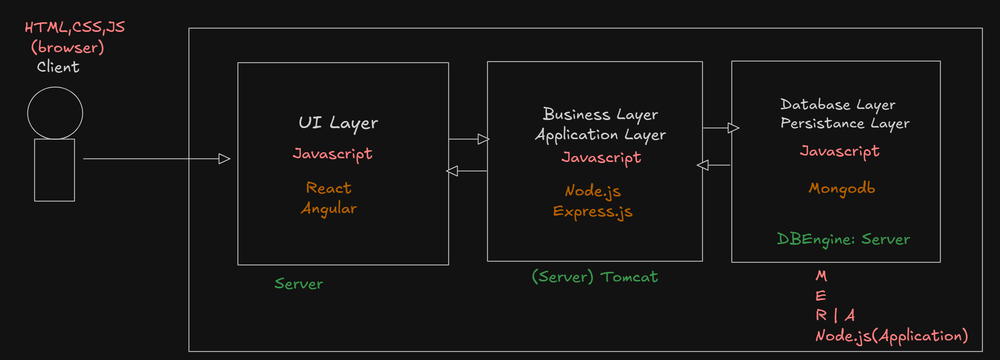
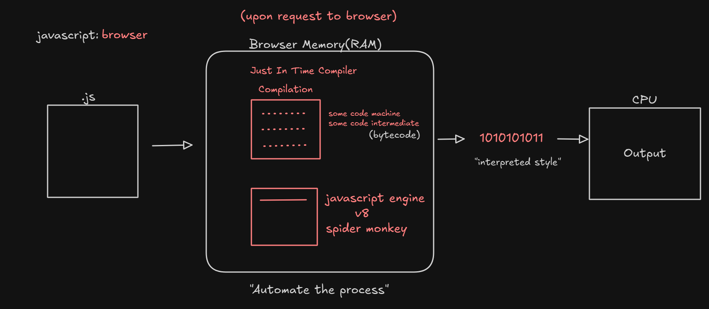
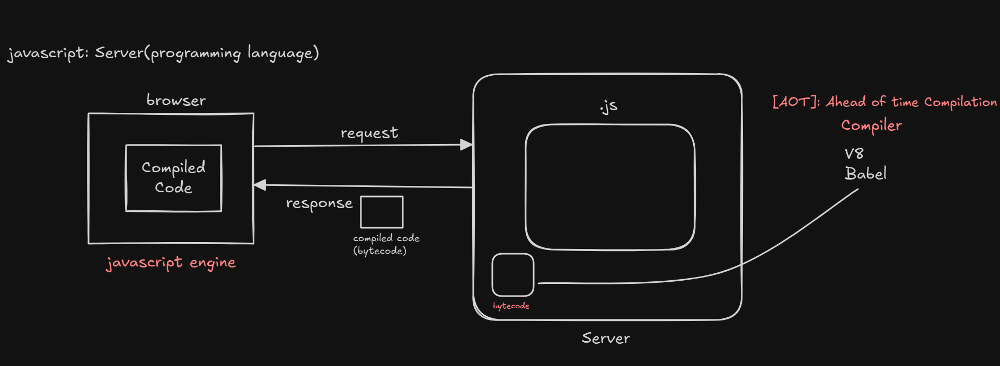

## Issues in Javascript
1. Javascript is not strongly typed[no need to work with datatypes].

   ```js
        var name = "sachin";
        name = true;
    ```
        
2. Javascript is not strictly typed[no rules and regulations].
   ```
    2 + 3 = 5
    3 - 2 = 1
    ```
    ```
    "2" + 3 = 23
    "3" - 2 = 1
    ```
3. Javascript is not good in handling the data as it is not structured.
   ```
   {
    [
        "Name":"TV";
        "Cost":45000;
    ],
    [
        "Name":"Mobile";
        "Cost":35000;
    ]
   }
    ```
4. Javascript is not 100% OOPs language.
    - it does not support dynamic polymorphism.
    - it is not secured (deletes cache memory).
  ---
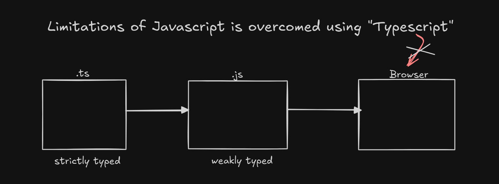
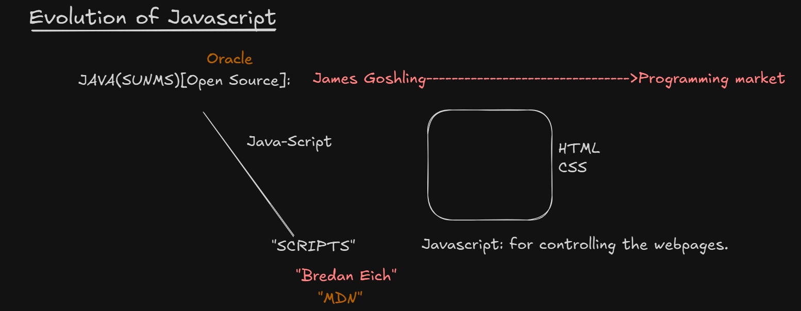

## Complete Overview of Page Rendering
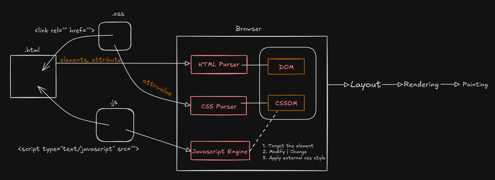

### FAQS
1. What is MIME type for script?
   
   ```
   1. <script type="text/javascript"></script>
   2. <script type="module"></script>
   ```

2. What is the difference between script in head and body?
   
    > In head section: It would be available in browser memory later it will be used while rendering.
    > 
    > In Body section: It would be a part of UI page directly.

3. How Javascript converts Static Dom into Dynamic Dom?
   
   > By linking Javascript code to html files.

4. What is strict mode in Javascript?
   > Javascript by default would not be in strict mode(no rules in declaration).
   >
   > In order to turn the strict mode "ON" we need to use "use strict";

   ```
   eg1: 
   <script type="text/javascript">
   a=10;
   console.log(a); //10
   </script>
   ```

   ```
   eg2: 
   <script type="text/javascript">
   "use strict";
   a=10;
   console.log(a); // uncaught refrence :a not defined
   </script>
   ```

   ```
   eg3: 
   <script type="text/javascript">
   "use strict";
   let a;
   a=10;
   console.log(a); // 10
   </script>
   ```

5. How to target Javascript for Legacy Browsers? [Old Version Browsers]
   
   How to target advanced features of CSS to work with all browsers?
    > Refer Image
    >
    > 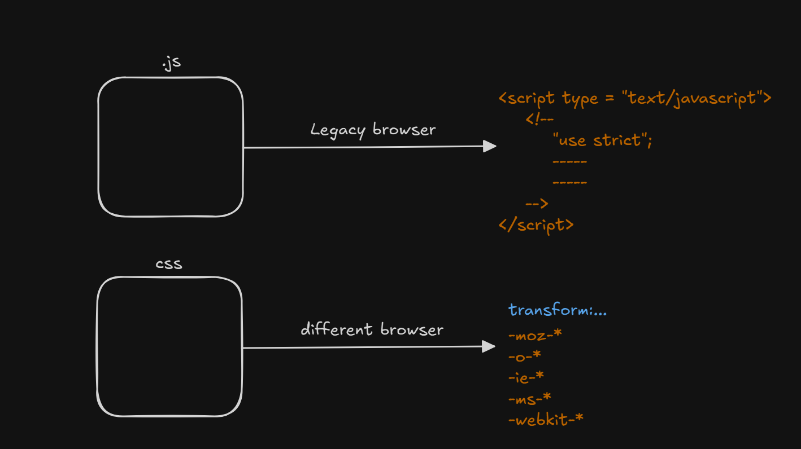

6. How to link external javascript file to html file?
   ```
   <script type = "text/javascript" src = "">
   ```

7. How Javascript take the control over the HTML elements?
   > We need to target the html elements and take control over the elements.

---
<br>

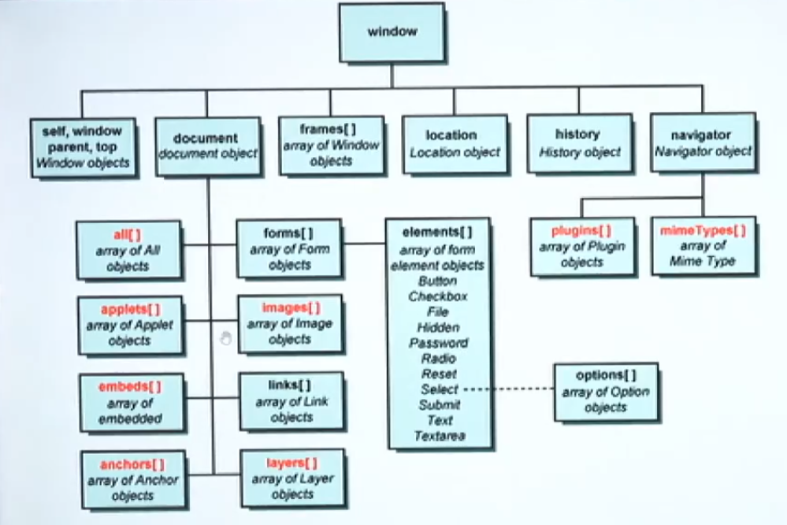
<br><br>
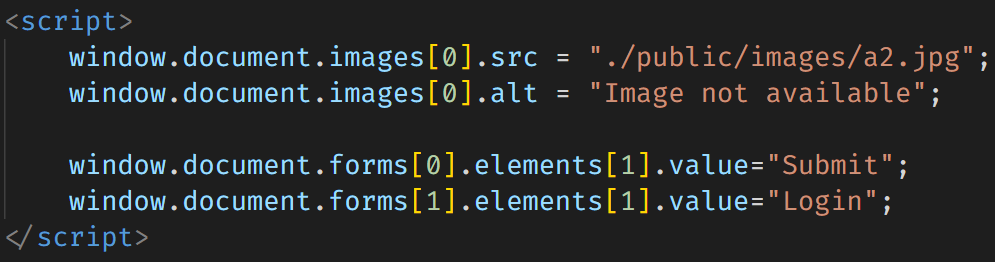
<br><br>
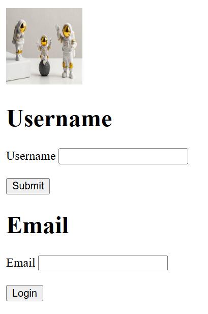
<br><br>
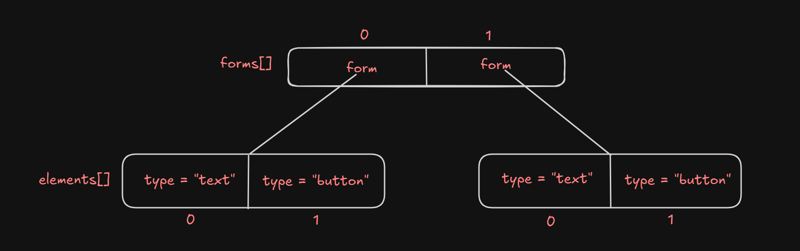
#### Note:- 
1.  In Javascript "Arrays are dynamic".
2. Acessing the elements using DOM heirarchy through index is not a good practice.
   > Solution: Access it with a name.

#### Using name attibute for HTML Elements
syntax: 
- name.property = value; //name is not a form element <br>
- formName.elementName.property = value; // if element is a form input
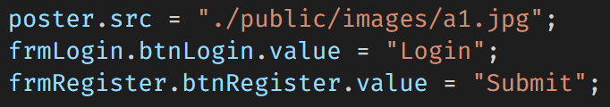

syntax: arrayOfElements = document.getElementsByName("Name").<br>
arrayOfElements[index].property = value;

#### Limitation
a. In case of radio buttons, multiple elements will have same name, at that time javascript code would fail.
<br><br>
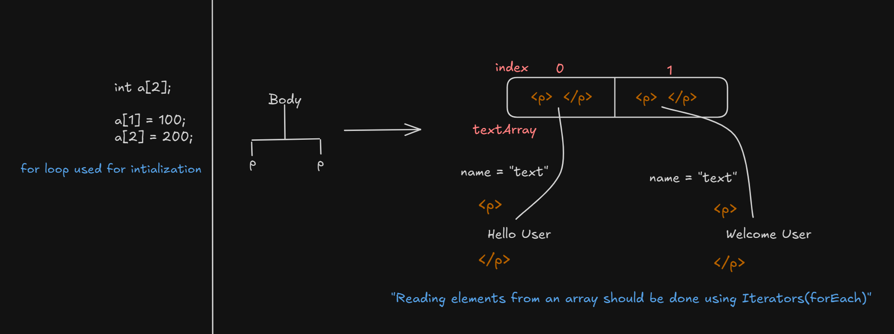
<br>
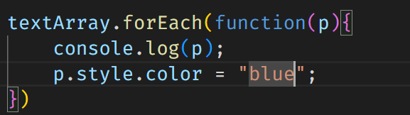

solution: access the element using "id".

3. document.getElementById("idName")
   
   limitation: while using styling if we use id selector on multiple elements then selecting the elements using javascript with the help of "ID" becomes tricky.

solution: use querySelector("css_selector");

css selectors <br>
a. primary : type(elementName), id(#), className(.) <br>
b. rational : parent child, adjacent(+), sibling(~), direct child(>) <br>
c. attribute: elementName[attribute], elementName[attributeName = value] <br>
d. dynamic pseudo <br>
e. structural <br>
f. validation state pseudo <br>
g. element state pseudo <br><br>

FAQ : What is the difference btw querySelector() and querySelectorAll()?
> querySelector() -> matches with the first element and retrieve the first element. <br>
if no match it returns null. <br>
querySelectorAll() -> matches all the elements and retrieve an array of elements. <br>
if no match it returns an empty array []. <br>

document <br>
   getElementsByName() : Array <br>
   getElementById() : unique element <br>
   querySelector() : unique element <br>
   querySelectorAll() : Array <br>
   getElementsByTagName() : Array <br>
   getElementsByClassName() : Array <br>


-----
## Javascript i/p and o/p operations
| Output                     | Input |
| :------------------------- | :---- |
| Javascript Output Methods  |       |
| a. alert()                 |       |
| b. confirm()               |       |
| c. document.write()        |       |
| d. console.****()          |       |
| e. innerText vs innerHtml  |       |
| f. outerText vs outerHtml  |       |
| g. textContent             |       |

#### 1. alert():

To display some alert message to the user upon doing some operation we use "alert()".
syntax: void: alert("string")
 
limitations:
 ```
   a. It accepts only string input, we can't use any HTML + CSS code to present our output.
   b. To get the cursor to the new line we need to use the delimiter called "\n".
 ```
Note:
   > To ensure the script would run upon loading the DOM we need to go for an even called "onload" on body element.
   ```html
   <body onload="">
   </body>
   ```
   Refer: 