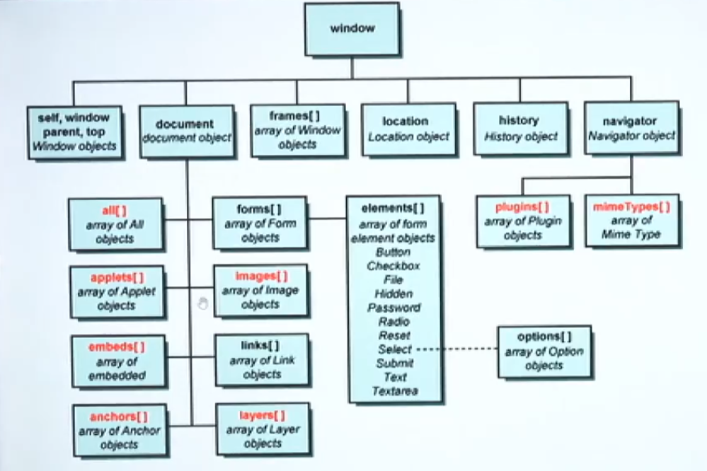

---

---

---

## ❓ Issues in Javascript
1️⃣  Javascript is not strongly typed[no need to work with datatypes].


   ```js
      var name = "sachin";
        name = true;
   ```
    
2️⃣  Javascript is not strictly typed[no rules and regulations].
   ```
    2 + 3 = 5
    3 - 2 = 1
    ```
    ```
    "2" + 3 = 23
    "3" - 2 = 1
   ```

3️⃣  Javascript is not good in handling the data as it is not structured.

   ```
   {
    [
        "Name":"TV";
        "Cost":45000;
    ],
    [
        "Name":"Mobile";
        "Cost":35000;
    ]
   }
   ```
   
4️⃣ Javascript is not 100% OOPs language.
   - ❌ it does not support dynamic polymorphism.
   - ❌ it is not secured (deletes cache memory).


## 🧭 Complete Overview of Page Rendering


###  ❓ FAQS
1. 💬  What is MIME type for script?
   
   ```
   1. <script type="text/javascript"></script>
   2. <script type="module"></script>
   ```

2. 🧠 What is the difference between script in head and body?
   
    > In head section: It would be available in browser memory later it will be used while rendering.
    > 
    > In Body section: It would be a part of UI page directly.

3. 🔄 How Javascript converts Static Dom into Dynamic Dom?
   
   > By linking Javascript code to html files.

4. 🧷  What is strict mode in Javascript?
   > Javascript by default would not be in strict mode(no rules in declaration).
   >
   > In order to turn the strict mode "ON" we need to use "use strict";

   📌 Examples:

   ```
   eg1: 
   <script type="text/javascript">
   a=10;
   console.log(a); //10
   </script>
   ```

   ```
   eg2: 
   <script type="text/javascript">
   "use strict";
   a=10;
   console.log(a); // uncaught refrence :a not defined
   </script>
   ```

   ```
   eg3: 
   <script type="text/javascript">
   "use strict";
   let a;
   a=10;
   console.log(a); // 10
   </script>
   ```

5. 🌐  How to target Javascript for Legacy Browsers? [Old Version Browsers]
   
   How to target advanced features of CSS to work with all browsers?
    > Refer Image
    >
    > 

6. 🔗 How to link external javascript file to html file?
   ```
   <script type = "text/javascript" src = "">
   ```

7. 🎮 How Javascript take the control over the HTML elements?
   > 👉 We need to target the html elements and take control over the elements.

---
<br>


<br><br>

<br><br>

<br><br>


#### 📝 Note:- 
1. ✅ In Javascript "Arrays are dynamic".
2. ⚠️ Acessing the elements using DOM heirarchy through index is not a good practice.
   > 💡 Solution: Access it with a name.

#### 🏷️ Using `name` attibute for HTML Elements
📌 syntax: 
- name.property = value; //name is not a form element <br>
- formName.elementName.property = value; // if element is a form input


📌 syntax: arrayOfElements = document.getElementsByName("Name").<br>
arrayOfElements[index].property = value;

#### ⚠️ Limitation with `name`
a. In case of radio buttons, multiple elements will have same `name`, at that time javascript code would fail.
<br><br>

<br>


solution: access the element using `id`.

3. 📌 document.getElementById("idName")
   
   ⚠️ Limitation: while using styling if we use id selector on multiple elements then selecting the elements using javascript with the help of "ID" becomes tricky.

💡 solution: use querySelector("css_selector");

🎯 CSS Selectors <br>
a. primary : type(elementName), id(#), className(.) <br>
b. rational : parent child, adjacent(+), sibling(~), direct child(>) <br>
c. attribute: elementName[attribute], elementName[attributeName = value] <br>
d. dynamic pseudo <br>
e. structural <br>
f. validation state pseudo <br>
g. element state pseudo <br><br>

❓ FAQ : What is the difference btw querySelector() and querySelectorAll()?
> querySelector() -> matches with the first element and retrieve the first element. <br>
if no match it returns null. <br>
querySelectorAll() -> matches all the elements and retrieve an array of elements. <br>
if no match it returns an empty array []. <br>

document <br>
   getElementsByName() : Array <br>
   getElementById() : unique element <br>
   querySelector() : unique element <br>
   querySelectorAll() : Array <br>
   getElementsByTagName() : Array <br>
   getElementsByClassName() : Array <br>


-----
## 🔁 Javascript i/p and o/p operations
| 📤 Output                    | 📥 Input                                 |
| :------------------------ | :------------------------------------ |
| Javascript Output Methods | Java Input Methods                    |
| a. alert()                | a. prompt()                           |
| b. confirm()              | b. queryString                        |
| c. document.write()       | c. using form elements(commonly used) |
| d. console.****()         |                                       |
| e. innerHTML vs outerHTML |                                       |
| f. innerText vs outerText |                                       |
| g. textContent            |                                       |

## 📤 Javascript Output Methods
#### 1. 🛎️ alert():

To display some alert message to the user upon doing some operation we use "alert()".
syntax: void: alert("string")
 
⚠️ limitations:
 ```
   a. It accepts only string input, we can't use any HTML + CSS code to present our output.
   b. To get the cursor to the new line we need to use the delimiter called "\n".
   c. We don't have cancel button to stop the process(use esc button).
 ```
📌 Note:
   > To ensure the script would run upon loading the DOM we need to go for an even called "onload" on body element.
   ```html
   <body onload="">
   </body>
   ```
   📎 Refer: [File](./jscodes/thirdjsclass.html)

   if a function is not returning anything in statically type language like c, c++, java, we can't call that function in output method calls like printf(), cout<<, System.out.println().<br><br>
   In Javascript, if a function is returning void still we can keep in output method calls and the output in the console would be "undefined".

#### 2. confirm()
This method is used to get the confirmation from the user.<br>
It has two buttons **ok** and **cancel**. <br>
   - ok     ---> true
   - cancel ---> false <br>

syntax:<br>
  boolean: confirm("msg");

<br>

limitations:

```
   a. It accepts only string input, we can't use any HTML + CSS code to present our output.
   b. To get the cursor to the new line we need to use the delimiter called "\n".
```
Eg1: Refer [File](./jscodes/4jsclass.html)

#### 3. document.write()
This method is used to write the content on the page, not like popups.

syntax:
  - void: document.write(string|expression|markup) : cursor in same line
  - void: document.writeln(string|expression|markup) : brings the cursor to new line

<br>

Limitation

```
a. It disturbs the DOM, the content will be loaded in the same page but on another "window".
```

> :memo: **Note:** String representation "" | ''<br>
&nbsp;&nbsp;&nbsp;&nbsp;&nbsp;&nbsp;&nbsp;&nbsp;&nbsp;&nbsp;&nbsp;&nbsp;&nbsp;&nbsp;if outer string is in " '' " <br>
&nbsp;&nbsp;&nbsp;&nbsp;&nbsp;&nbsp;&nbsp;&nbsp;&nbsp;&nbsp;&nbsp;&nbsp;&nbsp;&nbsp;if outer string is in ' "" ' <br>
Eg: 

Refer: [File](./jscodes/5jsclass.html) 


#### 4. innerHTML vs outerHTML
   
   This property is used to present the content on the same page along with other elements in the page.
   <br>

syntax:
- accesselement.innerHTML = "String | markup | expression";
- accesselement.outerHTML = "String | markup | expression";
  <br><br>

innerHTML: It keeps the element as the child element in the accessed container. <br>
outerHTML: It replaces the accessed container with the specified element(good for realtime).<br>

Refer: [File](./jscodes/6jsclass.html)


`<h1>` is replaced with `<h3>` whereas the second `<h3>` is placed  inside `<p>`.

<br>

#### 5. innerText vs outerText
This property is used to present the content on the same page along with other elements in the page.
   <br>

syntax:
- accesselement.innerText = "String";
- accesselement.outerText = "String";
  <br><br>

#### 6. textContent(used in realtime)
This property is used to present the content on the same page along with other elements in the page.
   <br>

syntax:
- accesselement.textContent = "String";
  <br><br>

## Javascript Input Methods

#### 1. prompt()
a. string: prompt("message", "optional value"); <br>
b. string: prompt("message"); <br>


Note: The entered input will always be in the form of "String".<br>
If the entered input is of the number type then we need to go for "typecoersion|typecasting" before processing the input.<br>

To print the value of the variable within the String we use the following syntax:<br>
a. \`${variableName}`<br>
b. "" + variableName<br>
c. "", variableName<br>

Refer: [File](./jscodes/7jsclass.html)

#### 2. querystring
It is a string which is constructed by the browser in the form of "K=V" pair in the form page. <br>
This string will be appended to the URL of the page.

syntax: url ? key1 = value1 & key2 = value2

To get querystring in javascript(Browser) we use BOM concept.<br>
syntax: str = location.search;

Note: Since the data is stored in string format we use string methods to retreive the result.<br>
a. indexOf("") : number<br>
b. slice(index) : string


Refer: [File](./jscodes/8jsclass.html)

input: `http://127.0.0.1:5500/javascript-code/query-string-code.html?name=sachin`<br>
output: sachin

#### 3. using form elements
      a. checkbox | radio
      b. textbox | password | number | email
      c. dropDown
      d. button
      e. progress | range 