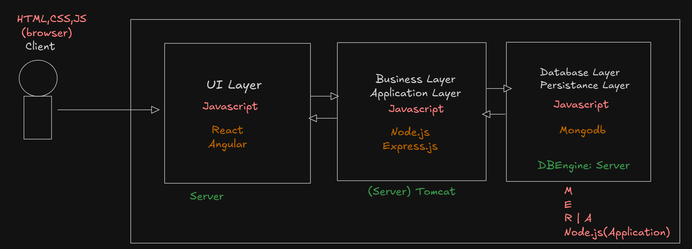
---
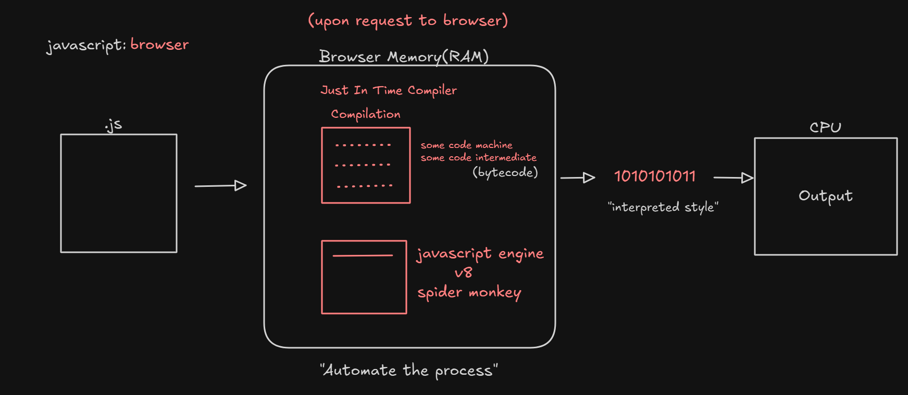
---
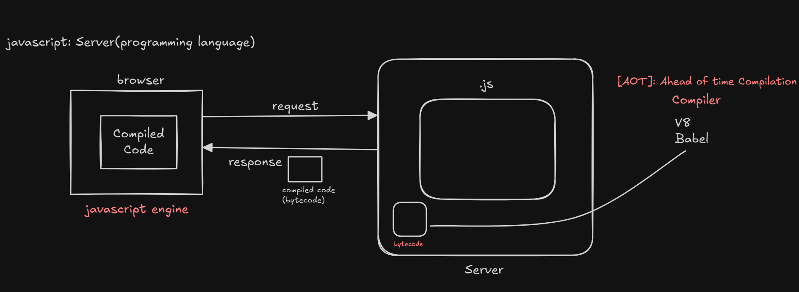
---

## ❓ Issues in Javascript
1️⃣  Javascript is not strongly typed[no need to work with datatypes].


   ```js
      var name = "sachin";
        name = true;
   ```
    
2️⃣  Javascript is not strictly typed[no rules and regulations].
   ```
    2 + 3 = 5
    3 - 2 = 1
    ```
    ```
    "2" + 3 = 23
    "3" - 2 = 1
   ```

3️⃣  Javascript is not good in handling the data as it is not structured.

   ```
   {
    [
        "Name":"TV";
        "Cost":45000;
    ],
    [
        "Name":"Mobile";
        "Cost":35000;
    ]
   }
   ```
   
4️⃣ Javascript is not 100% OOPs language.
   - ❌ it does not support dynamic polymorphism.
   - ❌ it is not secured (deletes cache memory).

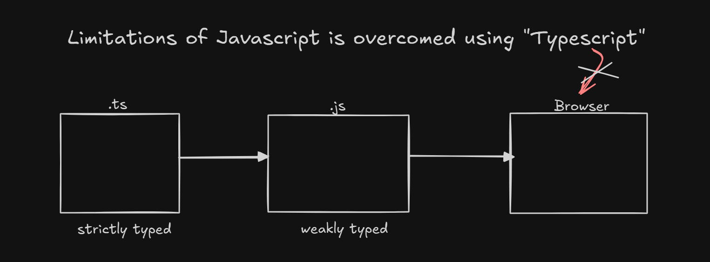

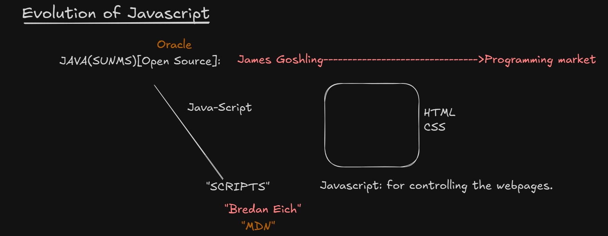

## 🧭 Complete Overview of Page Rendering
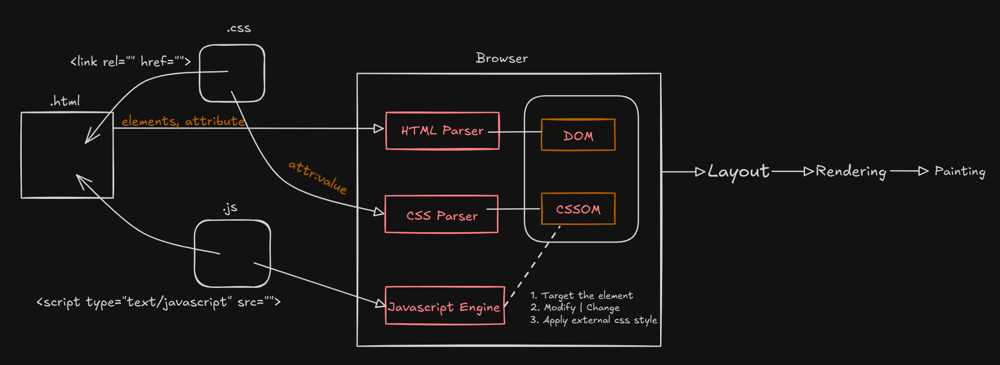

###  ❓ FAQS
1. 💬  What is MIME type for script?
   
   ```
   1. <script type="text/javascript"></script>
   2. <script type="module"></script>
   ```

2. 🧠 What is the difference between script in head and body?
   
    > In head section: It would be available in browser memory later it will be used while rendering.
    > 
    > In Body section: It would be a part of UI page directly.

3. 🔄 How Javascript converts Static Dom into Dynamic Dom?
   
   > By linking Javascript code to html files.

4. 🧷  What is strict mode in Javascript?
   > Javascript by default would not be in strict mode(no rules in declaration).
   >
   > In order to turn the strict mode "ON" we need to use "use strict";

   📌 Examples:

   ```
   eg1: 
   <script type="text/javascript">
   a=10;
   console.log(a); //10
   </script>
   ```

   ```
   eg2: 
   <script type="text/javascript">
   "use strict";
   a=10;
   console.log(a); // uncaught refrence :a not defined
   </script>
   ```

   ```
   eg3: 
   <script type="text/javascript">
   "use strict";
   let a;
   a=10;
   console.log(a); // 10
   </script>
   ```

5. 🌐  How to target Javascript for Legacy Browsers? [Old Version Browsers]
   
   How to target advanced features of CSS to work with all browsers?
    > Refer Image
    >
    > 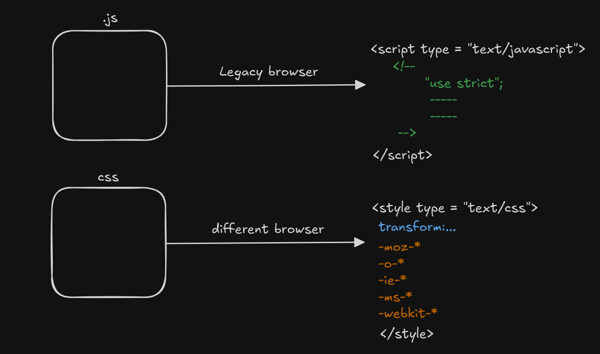

6. 🔗 How to link external javascript file to html file?
   ```
   <script type = "text/javascript" src = "">
   ```

7. 🎮 How Javascript take the control over the HTML elements?
   > 👉 We need to target the html elements and take control over the elements.

---
<br>


<br><br>

<br><br>
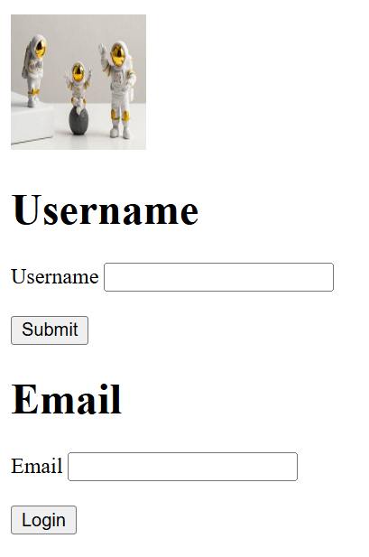
<br><br>
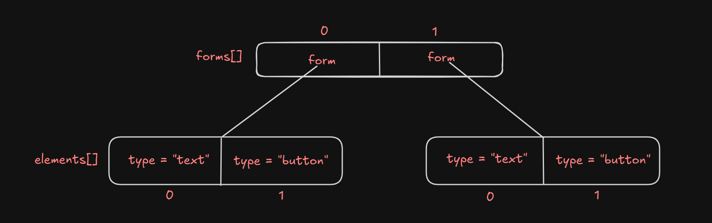

#### 📝 Note:- 
1. ✅ In Javascript "Arrays are dynamic".
2. ⚠️ Acessing the elements using DOM heirarchy through index is not a good practice.
   > 💡 Solution: Access it with a name.

#### 🏷️ Using `name` attibute for HTML Elements
📌 syntax: 
- name.property = value; //name is not a form element <br>
- formName.elementName.property = value; // if element is a form input
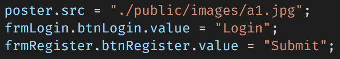

📌 syntax: arrayOfElements = document.getElementsByName("Name").<br>
arrayOfElements[index].property = value;

#### ⚠️ Limitation with `name`
a. In case of radio buttons, multiple elements will have same `name`, at that time javascript code would fail.
<br><br>
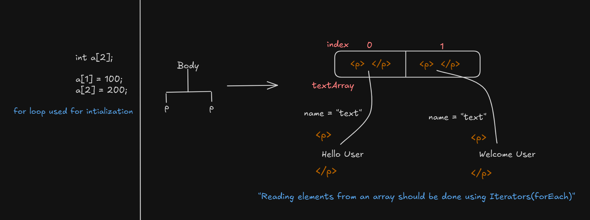
<br>
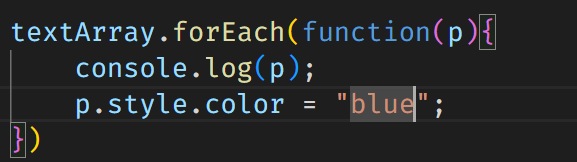

solution: access the element using `id`.

3. 📌 document.getElementById("idName")
   
   ⚠️ Limitation: while using styling if we use id selector on multiple elements then selecting the elements using javascript with the help of "ID" becomes tricky.

💡 solution: use querySelector("css_selector");

🎯 CSS Selectors <br>
a. primary : type(elementName), id(#), className(.) <br>
b. rational : parent child, adjacent(+), sibling(~), direct child(>) <br>
c. attribute: elementName[attribute], elementName[attributeName = value] <br>
d. dynamic pseudo <br>
e. structural <br>
f. validation state pseudo <br>
g. element state pseudo <br><br>

❓ FAQ : What is the difference btw querySelector() and querySelectorAll()?
> querySelector() -> matches with the first element and retrieve the first element. <br>
if no match it returns null. <br>
querySelectorAll() -> matches all the elements and retrieve an array of elements. <br>
if no match it returns an empty array []. <br>

document <br>
   getElementsByName() : Array <br>
   getElementById() : unique element <br>
   querySelector() : unique element <br>
   querySelectorAll() : Array <br>
   getElementsByTagName() : Array <br>
   getElementsByClassName() : Array <br>


-----
## 🔁 Javascript i/p and o/p operations
| 📤 Output                                                                           | 📥 Input                               |
| :--------------------------------------------------------------------------------- | :------------------------------------ |
| Javascript Output Methods                                                          | Java Input Methods                    |
| a. alert()                                                                         | a. prompt()                           |
| b. confirm()                                                                       | b. queryString                        |
| c. document.write()                                                                | c. using form elements(commonly used) |
| d. console.****()                                                                  |                                       |
| e. innerHTML vs outerHTML                                                          |                                       |
| f. innerText vs outerText                                                          |                                       |
| g. textContent                                                                     |
| h. console.log(), console.warn(), console.error(), console.info(), console.debug() |

## 📤 Javascript Output Methods
### 1️⃣ 🛎️ alert():

To display some alert message to the user upon doing some operation we use "alert()".
syntax: void: alert("string")
 
⚠️ limitations:
 ```
   a. It accepts only string input, we can't use any HTML + CSS code to present our output.
   b. To get the cursor to the new line we need to use the delimiter called "\n".
   c. We don't have cancel button to stop the process(use esc button).
 ```
📌 Note:
   > To ensure the script would run upon loading the DOM we need to go for an even called "onload" on body element.
   ```html
   <body onload="">
   </body>
   ```
   📎 Refer: [File](./jscodes/3jsclass.html)

   if a function is not returning anything in statically type language like c, c++, java, we can't call that function in output method calls like printf(), cout<<, System.out.println().<br><br>
   In Javascript, if a function is returning void still we can keep in output method calls and the output in the console would be "undefined".

---

### 2️⃣ ❓ confirm()
This method is used to get the confirmation from the user.<br>
It has two buttons **ok** and **cancel**. <br>
   - ✅ ok     ---> true
   - ❌ cancel ---> false <br>

📌 syntax:<br>
  boolean: confirm("msg");

<br>

⚠️ Limitations:

```
   a. It accepts only string input, we can't use any HTML + CSS code to present our output.
   b. To get the cursor to the new line we need to use the delimiter called "\n".
```
Eg1: 📎 Refer [File](./jscodes/4jsclass.html)

---

### 3️⃣ 📝  document.write()
This method is used to write the content on the page, not like popups.

📌 syntax:
  - void: document.write(string|expression|markup) : cursor in same line
  - void: document.writeln(string|expression|markup) : brings the cursor to new line

<br>

⚠️ Limitation

```
a. It disturbs the DOM, the content will be loaded in the same page but on another "window".
```

> :memo: **Note:** String representation "" | ''<br>
&nbsp;&nbsp;&nbsp;&nbsp;&nbsp;&nbsp;&nbsp;&nbsp;&nbsp;&nbsp;&nbsp;&nbsp;&nbsp;&nbsp;if outer string is in " '' " <br>
&nbsp;&nbsp;&nbsp;&nbsp;&nbsp;&nbsp;&nbsp;&nbsp;&nbsp;&nbsp;&nbsp;&nbsp;&nbsp;&nbsp;if outer string is in ' "" ' <br>
Eg: 

📎 Refer: [File](./jscodes/5jsclass.html) 


---

### 4️⃣ 🧩 innerHTML vs outerHTML
   
   This property is used to present the content on the same page along with other elements in the page.
   <br>

📌 syntax:
- accesselement.innerHTML = "String | markup | expression";
- accesselement.outerHTML = "String | markup | expression";
  <br><br>

innerHTML: It keeps the element as the child element in the accessed container. <br>
outerHTML: It replaces the accessed container with the specified element(good for realtime).<br>

📎 Refer: [File](./jscodes/6jsclass.html)

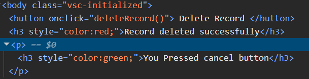

`<h1>` is replaced with `<h3>` whereas the second `<h3>` is placed  inside `<p>`.

<br>

---

### 5️⃣ 🖋️ innerText vs outerText
This property is used to present the content on the same page along with other elements in the page.
   <br>

syntax:
- accesselement.innerText = "String";
- accesselement.outerText = "String";
  <br><br>

---

### 6️⃣  🧾 textContent(used in realtime)
This property is used to present the content on the same page along with other elements in the page.
   <br>

syntax:
- accesselement.textContent = "String";
  <br><br>

#### 📌 Difference: `innerText` vs `textContent`

- **`textContent`**  
  ✔️ Returns **all text**, including from **hidden elements**  
  ✔️ **Faster** and better for **raw text**  
  ✔️ Ignores CSS layout and visibility  

- **`innerText`**  
  ✔️ Returns only **visible text**  
  ✔️ Respects **CSS visibility** and **layout**  
  ✔️ Includes **line breaks and spacing** as shown on screen  

> ⚠️ Use `textContent` for performance.  
> 🎯 Use `innerText` for accurate, visible representation.

> 💻 Related Code : 
<a href="./jscodes/textContent-innerText.html">textContent-innerText.html</a>

---
### 7️⃣🧾 Logs

- Logs refer to the **actions performed by the end user**.  
To **track user behavior or activity**, we use logs in JavaScript (commonly via `console.log()` or other logging tools).

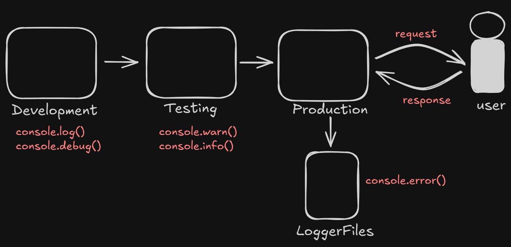

> 💻 Related Code : 
  <a href="./jscodes/ConsoleLog-info.html">ConsoleLog-info.html</a>
---

## 📥 Javascript Input Methods

### 1️⃣ 💬 prompt()
a. string: prompt("message", "optional value"); <br>
b. string: prompt("message"); <br>

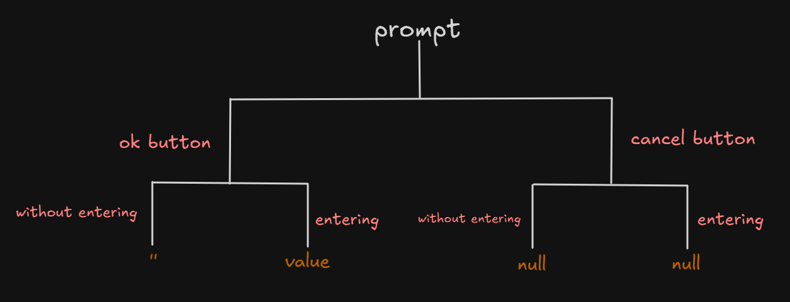

📌 Note: The entered input will always be in the form of "String".<br>
If the entered input is of the number type then we need to go for "typecoersion|typecasting" before processing the input.<br>

📌 To print the value of the variable within the String we use the following syntax:<br>
a. \`${variableName}`<br>
b. "" + variableName<br>
c. "", variableName<br>

Refer: [File](./jscodes/7jsclass.html)

---

### 2️⃣ 🔑 querystring
It is a string which is constructed by the browser in the form of "K=V" pair in the form page. <br>
This string will be appended to the URL of the page.

syntax: url ? key1 = value1 & key2 = value2

To get querystring in javascript(Browser) we use BOM concept.<br>
syntax: str = location.search;

Note: Since the data is stored in string format we use string methods to retreive the result.<br>
a. indexOf("") : number<br>
b. slice(index) : string

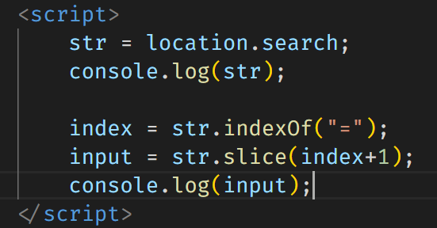
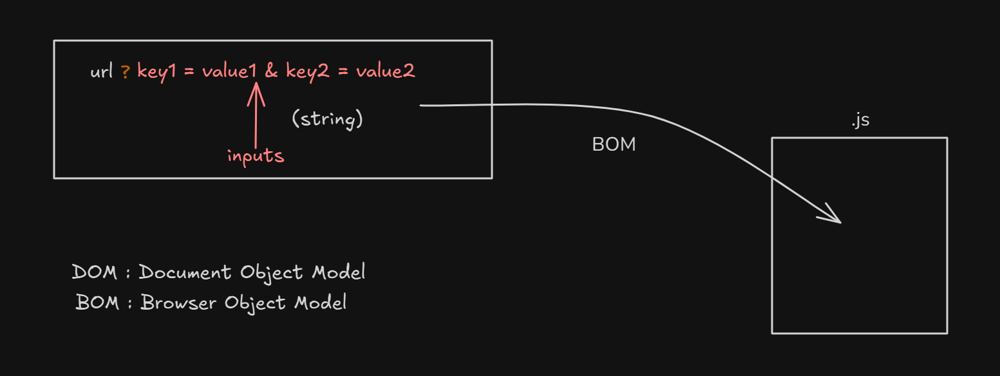

📎 Refer: [File](./jscodes/8jsclass.html)

📥 input: `http://127.0.0.1:5500/javascript-code/query-string-code.html?name=sachin`<br>
📥 output: sachin

---

### 3️⃣ 🧾 using form elements
      a. checkbox | radio
      b. textbox | password | number | email
      c. dropDown
      d. button
      e. progress | range 

# 🚀 How JavaScript Program is Executed (or How JavaScript Runs in the Browser)

* When JavaScript is loaded into the browser's engine, it forms an **Execution Engine** ⚙️  
  Inside the **Execution Context**, there are two main areas:
  1. 🧠 **Memory (Variable Environment)** – stores variables and function declarations
  2. 🔁 **Code Execution (Thread of Execution)** – executes code line by line

### 🖥️ JavaScript in Browser Engine  


* First, a **Global Execution Context (GEC)** is created automatically 🌐  
  Then, whenever a function is invoked, a **new Execution Context** is created and pushed onto the **Call Stack**, as shown below:

### 📦 Execution Context Stack  
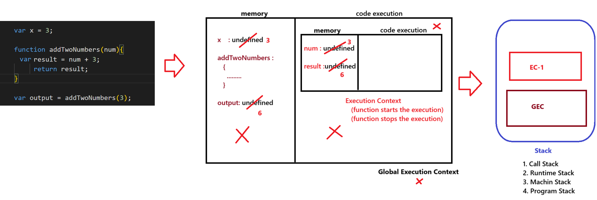

---

### 📝 Additional Points:

* JavaScript is **synchronous and single-threaded** 🧵 — it can only execute one command at a time in a specific order.

* The **Call Stack** 📚 keeps track of execution contexts — the one on top is always the currently running context.

* The **Execution Context** is created in two phases:
  1. 🔍 **Memory Creation Phase** – variables and functions are stored in memory (hoisted).
  2. ▶️ **Code Execution Phase** – code runs line by line using the stored memory.

---

> 💻 **Execution Context Code Example**:  
> <a href="./jscodes/executionContext">executionContext.html</a>

# Hoisting
- Hoisting: It is a phoenomenon in javascript where **variables and functions can be used without initialization.**
- var: It supports hoisting.
- If `var` variable holds a **function expression** or an **arrow function**, it **cannot** be used without intialization.
- Trying to do so will result in a `TypeError`.

> 🔔 **Note:**  
> ✅ `undefined` is printable.  
> ❌ `null` and `void` are not printable as meaningful output.

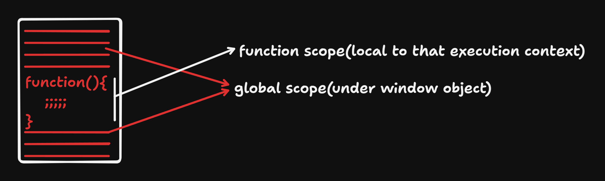

### Example 1 -> <a href="./jscodes/sample-code.html">sample-code.html</a>
```javascript
    var x=3;
    function getName(){
        console.log("PW IOI Javascript");
    }
    console.log(x);
    console.log(getName);
    getName();
```
**Soution:**

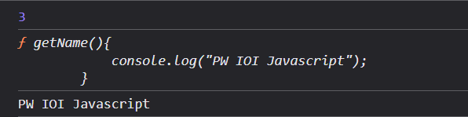

### Example 2 -> <a href="./jscodes/sample-code-2.html">sample-code-2.html</a>
```javascript
    console.log(x);
    console.log(getName);
    getName();

    var x=3;
    function getName()
    {
        console.log("PW IOI Javascript");
    }
```
**Soution:**

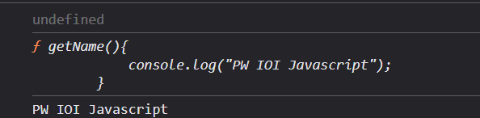

### Example 3 -> <a href="./jscodes/sample-code-3.html">sample-code-3.html</a>
```javascript
    console.log(x);
        console.log(getName);
        getName();
        console.log(getName1);
        getName1();
         
        var x=3;
        function getName(){
            console.log("PW IOI Javascript");
        }

        var getName1=function(){
            console.log("PW IOI React")
        }
        getName1();
```
**Soution:**

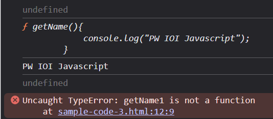

### Example 4 -> <a href="./jscodes/sample-code-4.html">sample-code-4.html</a>
```javascript
    console.log(x);
    console.log(getName);
    getName();
    
    console.log(getName2);
    getName2();
    console.log(getName1);
    getName1();
    var x=3;
    function getName(){
        console.log("PW IOI Javascript");
    }

    var getName1=function(){
        console.log("PW IOI React")
    }
    
    var getName2 = () =>{
        console.log("PW IOI Node.js");
    }
```
**Soution:**

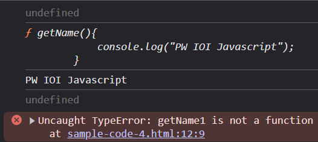


# 🧠 Local Execution Context & Memory Allocation

* Memory is given in the **Local Execution Context** of each function.
* Each function gets its own separate memory space when called.

### Example 5 -> <a href="./jscodes/sample-code-5.html">sample-code-5.html</a>
```javascript
    var x=1;
    a();
    b();
    function a(){
        var x=10;
        console.log(x);
    }
    function b(){
        var x=100;
        console.log(x);
    }

    console.log(x);
```
**Soution:**


---

# 🔍 Lexical Environment & Scope Chain

**Lexical Environment** = Memory of its container + its parent container

**Scope Chain** 🔗:  It refers to the **chain of lexical environments** used to identify  
the variables | functions to access.


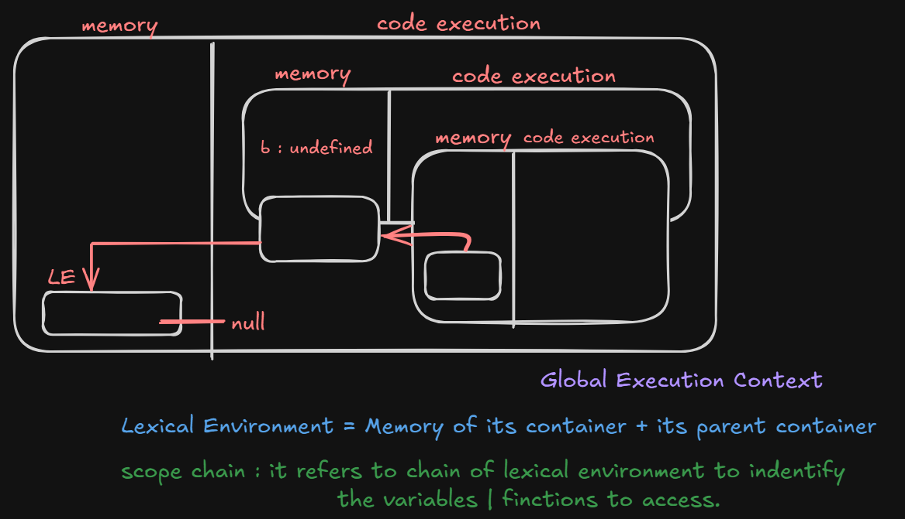

# 🧠 var vs let vs const in JavaScript

### 🔸 var:
- It supports hoisting with `'undefined'` as the result.
- Redeclaring the same variable is possible.
- Reassignment of value to a variable is possible.
- It is a **function scope** variable.
- It supports **shadowing**.

---

### 🔹 let:
- It supports hoisting  
  ➤ [Variable would be in **Temporal Dead Zone**: it can't be used without initializing]
- If we try to use the variable present in the Temporal Dead Zone, it would result in:  
  ⚠️ `ReferenceError: variable can't be accessed without initialization`
- Redeclaring the same variable is **not possible**.
- Reassignment of value to a variable is possible.
- They are **block scope** variables [Can't be used outside the block].
- It supports **shadowing** [Redeclaring the same variable in a different scope].

---

### 🔷 const:
- It supports hoisting  
  ➤ [Variable would be in **Temporal Dead Zone**: it can't be used without initializing]
- Redeclaring the same variable is **not possible**.
- Reassignment of value to a variable is also **not possible**  
  ⚠️ [It results in `TypeError`]
- They are **block scope** variables [Can't be used outside the block].
- It supports **shadowing** [Redeclaring the same variable in a different scope].

## 📊 var vs let vs const – Feature Comparison

| 🔧 Feature                | `var`                             | `let`                                                 | `const`                                                 |
|--------------------------|-----------------------------------|--------------------------------------------------------|----------------------------------------------------------|
| 🌍 Scope                 | Function Scope                    | Block Scope                                            | Block Scope                                              |
| 📦 Hoisting              | Yes (initialized as `undefined`) | Yes (but not initialized)    | Yes (but not initialized)      |
| 🔄 Can be Reassigned     | ✅ Yes                            | ✅ Yes                                                 | ❌ No                                                    |
| 🔁 Can be Redeclared     | ✅ Yes                            | ❌ No                                                  | ❌ No                                                    |
| 🕳️ Temporal Dead Zone   | ❌ No                             | ✅ Yes                                                 | ✅ Yes                                                   |
| 🔁 Use in Loops           | ⚠️ Not safe (due to function scope) | ✅ Safe 👍| ✅ Safe (if no reassignment)|
| 🌐 Global Object Property | ✅ Yes (if declared globally) | ❌ No| ❌ No|

---

## 🧠 Understanding `this`, `window`, and Global Variables in JavaScript

### 🔍 Key Concepts:
- Variables declared with `var` in the global scope are added to the `window` object (in browsers).
- Inside a regular function, `this` refers to the `window` object (when not in strict mode).
- Modifying `window.b` changes the global `b`.

---

### 🧪 Example:
> 💻 **Code**: <a href="../javascript-variable-declaration/scope-environment.html">scope-environment.html</a>
```javascript
var b = 3;

function a() {
    console.log(b);         // 🔸 3 – accesses global variable b
    console.log(this.b);    // 🔸 3 – 'this' refers to window in global context
    console.log(window.b);  // 🔸 3 – direct access via window object

    window.b = 100;         // 🔄 updates global b
}

a();

console.log(b); // 🔸 100 – value of b is updated by window.b
```

## 📝 Variable Naming Rules in JavaScript

1️⃣ Name must start with an **alphabet** or can start with `_` or `$`.

2️⃣ `_` is used for configuring a lot of constructs.  
It often refers to variables that require further implementation.

```javascript
var productName;     // its functionality is final 
var _productName;    // representation :: it is not yet implemented
```
3️⃣❌ Don't use special characters in variable names.
✅ Suggested by ECMA standards.

4️⃣ Name can be **alphanumeric**. `var product2020;`

5️⃣ Name is **case-sensitive.**

6️⃣ Name can be a maximum of **255 characters** long.

7️⃣ Avoid using single-character or overly long variable names.

8️⃣ Avoid using JavaScript **reserved keywords** (There are 45 total).
  ```javascript
    var const; // ❌ invalid
    var if;    // ❌ invalid
  ```
  
9️⃣ Always use camelCase for naming, and it should clearly describe what it is.
  ```javascript
    var u = "sachin";         // ❌ not a good approach
    var userName = "sachin";  // ✅ good approach
  ```
## 🔢📄 JavaScript DataTypes Overview

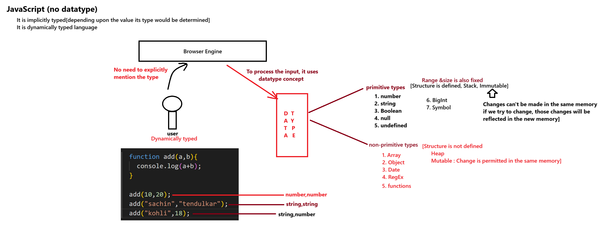

## 🔄 Mutable vs Immutable in JavaScript

### 📌 Key Concepts:
- **Primitive types** like `string` and `number` are **immutable** (can't be changed after creation).
- **Objects** are **mutable** – you can add, modify, or delete their properties.
- Even though primitives can hold properties, those are not retained as primitives don't have memory for object-like behavior.

---
### 🧪 Example Code:
> 💻 **Code**: <a href="./jscodes/mutable-immutable.html">mutable-immutable.html</a>
```javascript
  let str = "Hello";
  ``console.log(str);       // Hello

  str[0] = "Y";
  console.log(str);       // Hello (strings are immutable)

  console.log(typeof str); // string

  let myData = 10;
  myData.id = "Roll_number";
  console.log(myData);    // ❌ 10 (primitives can't store properties)

  let obj = { i: 10 };
  console.log(obj);       // { i: 10 }

  obj.name = "dev";
  console.log(obj);       // { i: 10, name: "dev" }

  obj.id = { country: "IND", type: "cricket" };
  console.log(obj);       // { i: 10, name: "dev", id: { country: "IND", type: "cricket" } }

  console.log(typeof obj); // object

  delete obj.id;
  console.log(obj);       // { i: 10, name: "dev" }
```

> **Note :**<br>
> Javascript object = {k : v} convert js object to JSON : json.stringify() <br>
> JSON Object = {k : v} convert string representation to JSON to js object : JSON.parse()<br>
>  💻 **JS to JSON Code**:   <a href="./jscodes/json.html">json.html</a>