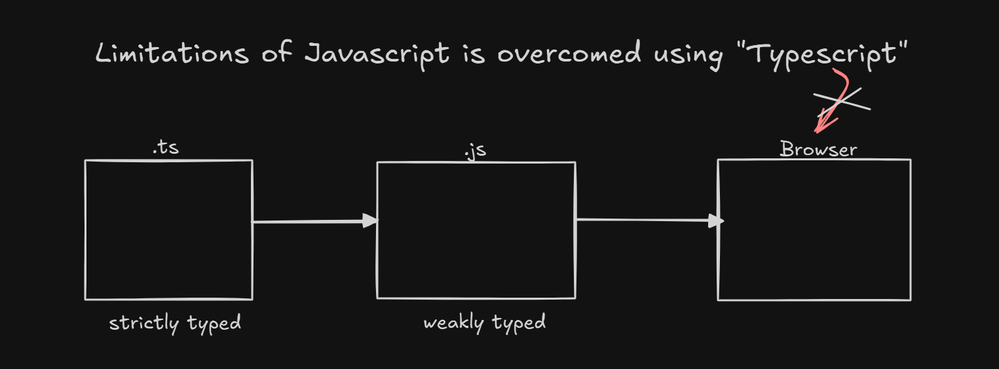

## Issues in Javascript
1. Javascript is not strongly typed[no need to work with datatypes].

   ```js
        var name = "sachin";
        name = true;
    ```
        
2. Javascript is not strictly typed[no rules and regulations].
   ```
    2 + 3 = 5
    3 - 2 = 1
    ```
    ```
    "2" + 3 = 23
    "3" - 2 = 1
    ```
3. Javascript is not good in handling the data as it is not structured.
   ```
   {
    [
        "Name":"TV";
        "Cost":45000;
    ],
    [
        "Name":"Mobile";
        "Cost":35000;
    ]
   }
    ```
4. Javascript is not 100% OOPs language.
    - it does not support dynamic polymorphism.
    - it is not secured (deletes cache memory).
  ---



## Complete Overview of Page Rendering


### FAQS
1. What is MIME type for script?
   
   ```
   1. <script type="text/javascript"></script>
   2. <script type="module"></script>
   ```

2. What is the difference between script in head and body?
   
    > In head section: It would be available in browser memory later it will be used while rendering.
    > 
    > In Body section: It would be a part of UI page directly.

3. How Javascript converts Static Dom into Dynamic Dom?
   
   > By linking Javascript code to html files.

4. What is strict mode in Javascript?
   > Javascript by default would not be in strict mode(no rules in declaration).
   >
   > In order to turn the strict mode "ON" we need to use "use strict";

   ```
   eg1: 
   <script type="text/javascript">
   a=10;
   console.log(a); //10
   </script>
   ```

   ```
   eg2: 
   <script type="text/javascript">
   "use strict";
   a=10;
   console.log(a); // uncaught refrence :a not defined
   </script>
   ```

   ```
   eg3: 
   <script type="text/javascript">
   "use strict";
   let a;
   a=10;
   console.log(a); // 10
   </script>
   ```

